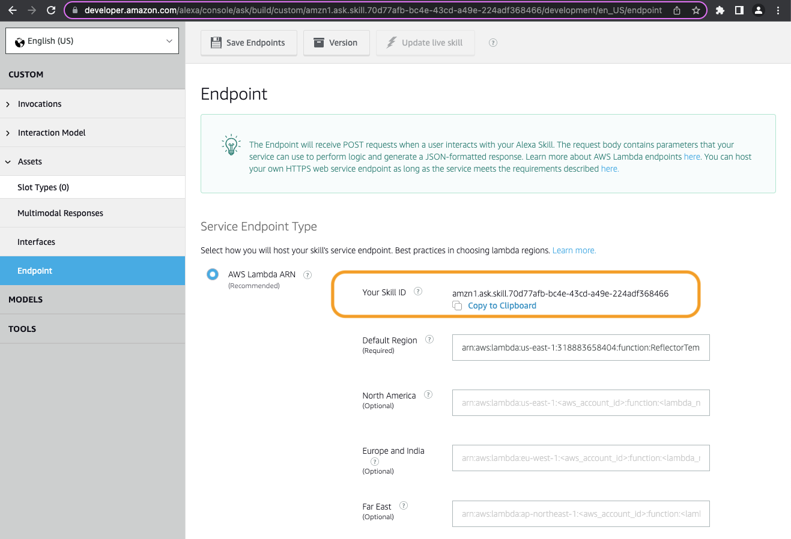
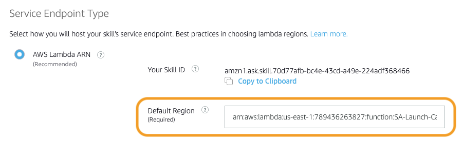

# Install Instructions

## Deploy pre-requisite servides
Go to CloudFormation and deploy the AlexaSkill_Infrastructure_CFT.yml template
  

## Build the code package
Ensure that the latest version of python is installed on your machine
* brew install pyenv
* pyenv install  3.11
* pyenv global 3.11
* eval "$(pyenv init -)"
* brew install virtualenv poetry
* pyenv versions
  

## Upload the code artifact to the skill bucket
In the console, go to S3, and upload the code package found in the dist directory to the root of the S3 bucket that was created with the Infrastructure CF Template.
  

## Deploy the lambda function template
Go back to CloudFormation and deploy the AlexaSkill_Lambda_CFT.yml template.
 

>For this step you will need to copy the Skill ID from the Alexa Developer Console found under the 'Endpoint' section of the skill, as it will be a required parameter in the template.
 

  

## Add the Lamba Function ARN to the Alexa Skill in the Alexa Dev Console
Navigate back to the Alexa Development Console, and under the 'Endpoint' section, replace the placeholder ARN in the 'Default Region' field located under the Skill Id with the actual ARN of the lambda function that was deployed in the above steps.
 

 

> Be sure to hit the __Save Endpoints__ button once the ARN of the lambda function has been pasted.
  

## References:
[Using Amazon Alexa to turn off your EC2 Instances](https://rav3n.medium.com/using-amazon-alexa-to-turn-off-your-ec2-instances-b3a9e051307d)
